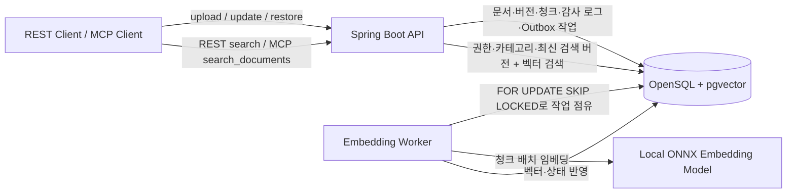

# Tibero OpenSQL MCP

> OpenSQL(pgvector) 안에서 문서의 원문·버전·권한·임베딩 벡터를 함께 관리하는 AI 문서 검색 플랫폼

이 프로젝트는 [2026 오픈소스 개발자대회](https://osscontest.kr/overview)의 티맥스티베로 지정과제인 **OpenSQL 기반 AI 검색 및 벡터 데이터 플랫폼 개발**을 수행합니다. 문서를 업로드하면 로컬 임베딩 모델이 청크를 벡터화하고, 사용자는 메타데이터 조건과 의미 검색을 함께 사용해 문서를 찾을 수 있습니다.

과제 안내: [티맥스티베로 지정과제](https://www.kossa.kr/materials/2026/ossp/tasks-tmax.html)

## 문제와 목표

일반적인 문서 RAG는 원문 변경과 벡터 갱신이 분리되어 있어, 새 버전 임베딩 중 검색 결과가 사라지거나 장애 시 처리 작업이 유실될 수 있습니다.

이 프로젝트는 다음을 목표로 합니다.

- OpenSQL의 PostgreSQL·pgvector 기반에서 정형 데이터와 벡터를 함께 관리한다.
- 원문 버전과 검색에 노출하는 마지막 정상 벡터 버전을 분리한다.
- 로컬 ONNX 임베딩으로 외부 임베딩 API 없이 문서를 벡터화한다.
- 다중 애플리케이션 인스턴스에서도 DB 행 잠금으로 임베딩 작업을 한 번만 점유한다.
- REST와 MCP `search_documents` 도구로 의미 검색을 제공한다.

## 현재 기능

- 문서 업로드·청킹·비동기 로컬 임베딩
- PDF·UTF-8 TXT 파일 업로드와 버전별 원본 파일 메타데이터 보존
- `ownerId`, `category` 필터와 pgvector 코사인 유사도 검색을 하나의 SQL로 결합
- 코사인 거리 연산자(`<=>`)와 동일한 연산자 클래스의 부분 HNSW 인덱스로 임베딩 완료 청크 검색 가속
- 문서 버전 이력, 낙관적 버전 충돌 방지, 논리 삭제, 과거 버전 기반 새 버전 복원
- 새 버전이 `PENDING`인 동안 직전 정상 버전(`current_search_version`)을 검색에 유지
- 문서 버전당 하나의 Outbox 작업과 `FOR UPDATE SKIP LOCKED` 기반 다중 워커 점유
- MCP Streamable HTTP의 `search_documents` 도구

## 아키텍처



### 문서와 벡터의 버전 전환

```text
v1 업로드: PENDING
  └─ 임베딩 완료: v1 EMBEDDED, current_search_version = 1

v2 수정: PENDING, current_search_version = 1 유지
  ├─ 임베딩 완료: v2 EMBEDDED, current_search_version = 2
  └─ 임베딩 실패: v2 FAILED, current_search_version = 1 유지
```

`documents.version`은 최신으로 작성된 원문 버전이고, `current_search_version`은 검색에 노출할 마지막 정상 임베딩 버전입니다. 따라서 비동기 처리 중에도 기존 검색 결과를 유지합니다.

### 감사 로그와 작업의 역할

| 구성 | 역할 | 예시 |
| --- | --- | --- |
| `ingestion_log` | 발생 사실을 보존하는 감사 이력 | `CREATED`, `UPDATED`, `EMBEDDED`, `FAILED` |
| `ingestion_tasks` | 워커가 현재 점유·처리할 Outbox 작업 | `PENDING → PROCESSING → EMBEDDED/FAILED` |

모든 인스턴스가 폴링해도 `ingestion_tasks`를 `FOR UPDATE SKIP LOCKED`로 점유하므로 같은 작업을 중복 처리하지 않습니다. 모델 추론은 점유 트랜잭션이 끝난 뒤 실행해 DB 락을 길게 유지하지 않습니다.

## 기술 스택

- Java 21, Spring Boot 4.1, Gradle
- Tmax OpenSQL / PostgreSQL 17, pgvector
- Spring Data JPA, JDBC batch, Flyway
- Spring AI Transformers, 로컬 ONNX `all-MiniLM-L6-v2` 임베딩 모델 (384차원)
- Spring AI MCP Server (Streamable HTTP)
- Testcontainers, Spotless, springdoc-openapi

## 시작하기

### 사전 조건

- Java 21
- Docker Desktop (통합 테스트용)
- pgvector 확장이 설치된 OpenSQL 인스턴스

OpenSQL 연결 정보는 환경 변수로 주입합니다. 비밀번호는 저장소에 커밋하지 않습니다.

```bash
export SPRING_DATASOURCE_URL='jdbc:postgresql://<host>:5432/opensql'
export SPRING_DATASOURCE_USERNAME='opensql'
export SPRING_DATASOURCE_PASSWORD='<password>'

./gradlew bootRun
```

애플리케이션을 시작하면 Flyway가 스키마와 pgvector 확장을 적용합니다. API 문서는 `http://localhost:8080/swagger-ui.html`에서 확인할 수 있습니다.

### 검증

```bash
./gradlew test
./gradlew build
```

테스트는 Testcontainers의 `pgvector/pgvector` 이미지로 실제 벡터 연산과 Flyway 마이그레이션을 검증합니다.

## 주요 API

| 목적 | 메서드 | 경로 |
| --- | --- | --- |
| 문서 업로드 | `POST` | `/api/documents` |
| 파일 업로드 | `POST` | `/api/documents/files` |
| 문서 상태 조회 | `GET` | `/api/documents/{documentId}?ownerId=` |
| 버전 이력 조회 | `GET` | `/api/documents/{documentId}/versions?ownerId=` |
| 새 버전 업로드 | `PUT` | `/api/documents/{documentId}` |
| 파일 새 버전 업로드 | `PUT` | `/api/documents/{documentId}/file` |
| 논리 삭제 | `DELETE` | `/api/documents/{documentId}?ownerId=&expectedVersion=` |
| 과거 버전으로 복원 | `POST` | `/api/documents/{documentId}/versions/{version}/restore` |
| 의미 검색 | `GET` | `/api/search?query=&ownerId=&category=&limit=` |

### MCP 검색 도구

Streamable HTTP MCP 엔드포인트는 `/mcp`이며, `search_documents` 도구를 제공한다. 도구는 REST 검색과
동일하게 `query`, `ownerId`, 선택 `category`, `limit`을 받는다. 결과에는 문서 ID, 현재 문서 제목·카테고리,
실제로 검색에 사용된 `documentVersion`, 청크 번호, 본문, 유사도 점수가 포함된다. 따라서 에이전트는 답변에
사용한 문서와 검색 버전을 함께 제시할 수 있다.

로컬 Codex 검증은 애플리케이션을 Mac에서 실행한 뒤 `~/.codex/config.toml`에 아래처럼 등록한다. DB는 UTM
OpenSQL에 연결해도 되지만, MCP 주소는 Codex가 실행 중인 Mac의 localhost를 사용한다.

```toml
[mcp_servers.tibero_local]
url = "http://127.0.0.1:8080/mcp"
enabled_tools = ["search_documents"]
default_tools_approval_mode = "prompt"
```

등록 후 Codex를 재시작하고, 새 task에서 `search_documents` 도구로 ownerId 범위의 검색을 요청한다. 현재
`ownerId`는 1차 평가용 검색 범위이며 인증된 사용자 정보가 아니다. 따라서 현재 REST API와 MCP 엔드포인트는
로컬 데모 또는 신뢰 가능한 내부 네트워크에서만 실행한다. 외부 공개 전에는 JWT의 인증 principal로 소유 범위를
결정하고 권한을 검증하도록 교체한다.

문서 업로드 예시:

```bash
curl -X POST http://localhost:8080/api/documents \
  -H 'Content-Type: application/json' \
  -d '{
    "idempotencyKey": "policy-001",
    "title": "보안 정책",
    "content": "문서 원문을 입력합니다.",
    "ownerId": "team-a",
    "category": "policy"
  }'
```

파일 업로드 예시:

```bash
curl -X POST http://localhost:8080/api/documents/files \
  -F 'file=@./security-policy.pdf;type=application/pdf' \
  -F 'idempotencyKey=policy-file-001' \
  -F 'ownerId=team-a' \
  -F 'category=policy'
```

PDF와 UTF-8 TXT만 지원한다. 파일 자체는 10 MiB 이하이며, multipart 경계·헤더를 고려해 요청 전체는 11 MiB 이하로 제한한다. PDF는 최대 1,000페이지·200만 문자까지만 추출하며, 문자 상한은 추출 도중 적용한다. 원본 파일 바이트는 저장하지 않고 추출 원문과 파일명·검증 MIME 타입·크기·SHA-256만 버전 이력에 보관한다. 암호화·손상·텍스트가 없는 PDF와 빈/잘못된 인코딩의 TXT는 거절한다.

## 프로젝트 문서

- [개발 내역](docs/development-log.md)
- [설계 결정 사항](docs/design-decisions.md)
- [OpenSQL Single 실환경 smoke 검증](docs/verification/opensql-single-smoke.md)
- [OpenSQL Single 실패·수동 재처리 smoke 검증](docs/verification/opensql-single-failure-recovery-smoke.md)
- [코드·API 설계 규칙](docs/ai/engineering-standards.md)
- [테스트 규칙](docs/ai/testing-standards.md)

## 다음 단계

- 처리 중 중단된 `PROCESSING` 작업의 lease 만료·회수
- 최종 실패 작업의 수동 재처리
- 문서·버전별 임베딩 처리 상태 조회 API
- 하이브리드 검색과 벡터 인덱스 성능 검증

## 참고

- [2026 오픈소스 개발자대회 개요](https://osscontest.kr/overview)
- [티맥스티베로 지정과제](https://www.kossa.kr/materials/2026/ossp/tasks-tmax.html)
- [OpenSQL 제품 소개](https://www.tibero.com/ko/products/OpenSQL)
